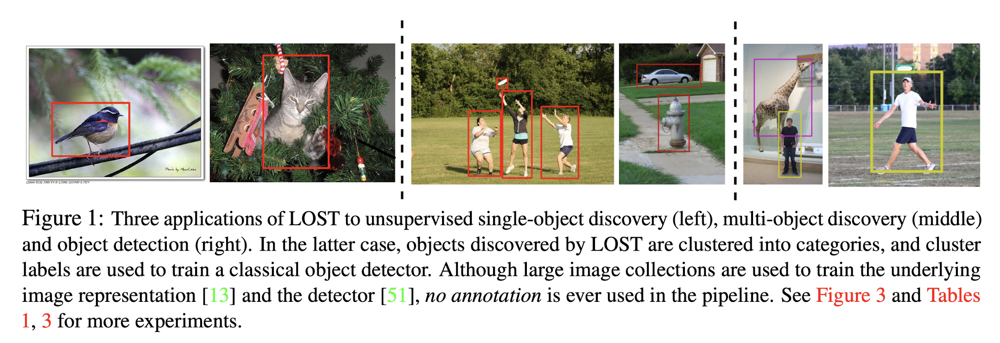
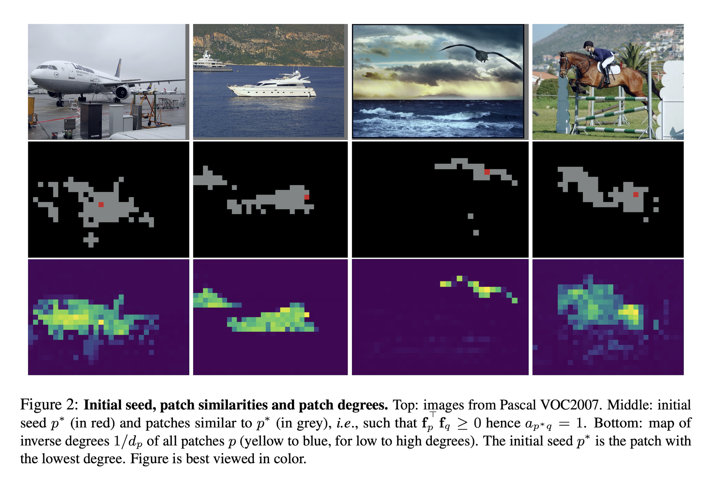
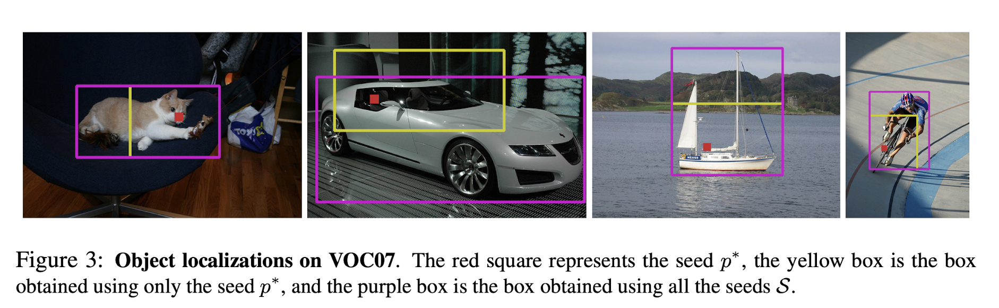

# Localizing Objectes with Self-Supervised Transformers and no Labels 

**keyword** :`Localizing `, `Self-supervised`, `Vision Transforemr`, `DINO`

**Year/Month** : 2021/09 

**code**: https://github.com/valeoai/LOST 

#### Abstract 

객체 위치 식별을 위한 어노테이션을 추가하는 작업은 코스트가 높기 때문에 슈퍼비전 없이 객체 위치 식별을 할 수 있다면 이러한 코스트를 피할 수 있다. 본 논문의 저자들은 간단한(하다고 주장하는) 접근법으로 문제를 해결했다. 자가 지도 방식으로 사전 학습된 트랜스포머의 활성 특징(activation features)를 이용하는 것이다. 논문에서는 이와 같은 방식으로 기존의 소타를 뛰어넘는 성능을 냈다고 주장한다.

## Introduction

Object detector는 자율 주행 자동차 등에서 굉장히 중요한 시스템의 일부이다. 하지만 높은 성능을 내기 위해서는 많은 양의 라벨이 있는 데이터를 학습해야 했고 이는 높은 비용이 요구됐다. 이러한 문제를 해결하기 위한 접근들은 semi-supervision, weak supervision, active-learning, self-supervision 등이 있다. 

본 논문에서는 이미지에 어노테이션이 전혀 없는 극단적인 상황을 가정했다. 초기의 연구들은 regions proposal은 saliency 나 intra-image similarity(이미지 내부만을 고려하고 이미지들간의 유사성은 고려하지 않음)를 고려했다. 하지만 이러한 region proposal은 정확도가 낮고 다른 task의 search space를 위해서 대량으로 생산될 뿐이었다. 보통 비지도 객체 위치 식별에서 region proposal들을 인풋으로 넣고, 전체 이미지(entire image collection)들을 정보와 inter-image similarities를 이용해서 객체의 위치를 식별한다. 

> Often using region proposals as input, unsupervised object discovery leverages information from the entire image collection and explores inter-image similarities to localize objects in an unsupervised fashion, e.g., with probabilistic matching [15], principal component analysis [72], optimization [67, 68] and ranking [69].

위와 같은 방식은 이미지간의 region 비교의 복잡도가 quadratic하게 증가하기 때문에 대량의 이미지셋에서 사용하기 어렵다는 한계점이 있다. 

본 논문에서 제시하는 방법은 이미지들 간의 비교(inter - image)를 사용하지 않고 단일 이미지 수준(single image)에서 가능하기 때문에 복잡도가 선형적으로 증가하기에 높은 확장성을 가지고 있다. 이를 위해서 자기 지도 방식으로 학습된 높은 수준의 비전 트랜스 포머인 DINO를 사용했으며, cls 토큰이 아닌 마지막 어텐션 레이어의 *key* component를 사용해서 패치들간의 유사성을 비교했다. 가장유사한 패치가 적은 패치(seed patch or initial seed)를 골라내고 seed patch와 유사한 patch를 찾는 seed expansion을 통해서 객체가 위치한 patch들을 찾았다. 최종적으로 seed 를 포함하고 있는 largest connected component를 이용해서 바운딩 박스를 찾았다. 

>  **저자들은 객체가 있는 패치가 배경이 있는 패치와 유사도가 적은 것을 경험적으로 관찰했고 이를 적용해봤다고 seed selection방식을 선택한 것을 justification했다.**  

본 논문에서는 단일 객체 위치 식별, 다중 객체 위치 식별, clustering을 이용한 객체 class 분류 등을 사람의 supervision 없이 모두 가능하다고 한다. - Unsupervised class - aware object detection 이라고 표현했다. 

## Related work 

#### Object detection with limited supervision 

#### Object discovery 

#### Transformers 

#### Self-supervised learning (SSL)

## Proposed approach 

### Transformers for Vision 

비전 트랜스포머 작동 원리 링크 연동 예정

### Finding objects with LOST 

본 논문의 방법론은 *d* 차원의 이미지 features $F \in R^{N \cross d} \; where, N = \# \; of \; patches $ 를 사용한다. $f_{p} \in R^{d}, \; p \in \{1,...,N \}$은 단일 패치를 나타낸다. 본 방법론은 이미지에 적어도 하나 이상의 객체가 존재한다고 가정하며, LOST는 주어진 feature를 이용해서 객체들중 하나의 위치를 식별하려고 한다. 이는 최종적으로 seed patch - 가장 높은 확률로 객체에 속해있을 patch를 선택함으로써 이루어진다. 

**Initial seed selection.** Seed를 선택하는 방법론은 다음과 같은 가정을 기반에 두고 있다. (a)객체에 속해있는 regions/pathes(이하 patch들) 들은 배경에 속한 patch들에 비해서 서로에게 더 큰 상관 관계를 가지며 vice versa. (b)개별 객체는 배경보다 이미지에서 작은 영역을 차지하고 있다. 따라서 적은 상관 관계를 가지는 패치는 객체에 속할 확률이 높다. 

패치들의 상관 관계를 계산하기 위해서 트랜스포머의 key들을 사용했다. 저자들은 key를 사용할 때 가장 (a)가정에 잘 부합하는 것을 경험적으로 관찰했다고 한다. (b)가정에 따라서 가장 적은 양의 상관 관계를 가지는 패치를 initial seed $p^{*}$로 선택했다. 

더 정확하게는 각 이미지에 대해서 패치 유사도 그래프 $G$를 만들었으며, 이는 이진 시메트릭 근접 행렬 $A = (a_{pq})_{1 \leq p,q \leq N} \in \{0,1\}^{N \cross N}$으로 나타낼 수 있다. 
$$
a_{pq}  = \begin{cases} 
	1 \quad \text{if }\mathrm{f}_{p}^{\top}\mathrm{f}_{q} \geq 0, \\
	0 \quad \text{otherwise.}
\end{cases}
$$
두개의 노드 $p,q$ 는 만약 feature $\mathrm{f}_{p},\mathrm{f}_{q}$ 가 양의 상관관계를 가지고 있다면 비직접적으로 연결되었다고 본다. Initial seed $p^{*}$는 가장 낮은 $d_{p}$를 가지는 seed이다. 
$$
p^{*} = {arg\min_{p \in \{1,...,N\}}} d_{p} \quad \text{where} \; d_{p} = \sum^{N}_{q=1}a_{pq}
$$

Figure 2는 4개의 서로 다른 이미지에서 seed $p^*$(빨간점)을 선택한 것이다. 그림의 가운데 줄에서 보이는 것과 같이 seed 와 양의 상관 관계를 가지는 patch들도 객체에 속할 확률이 높은 것을 알 수 있다. 

**Seed expansion.** 초기 seed $p^*$가 선택된 이후에 양의 상관 계수를 가지는 $\mathrm{f}_{p^*} : \{q | q \in \mathrm{D}_{k}\;\text{and}\;\mathrm{f}_{q}^{\top}\mathrm{f}_{p^*} \geq 0\}$ 패치를 선택한다. $\mathrm{D}_{k}$ 는 가장 적은 연결관계를 가지는 $k$개의 patch들이다. 만약 연결관계의 수가 같다면 임의로 tie break를 실시하였다. $p^* \in \mathrm{D_{k}}$가 성립하고,  $k$는 100으로 설정했다.  

**Box extraction.** 마스크 $m \; \in \{0,1\}^{N}$ 을 결정하기 위해서 모든 이미지 features 와 seed features in $\mathrm{S}$ 을 비교한다. $q^{th}$ 마스크 $m$은 아래를 만족한다. 
$$
m_{q} = \begin{cases}
 1 \quad \text{if} \; \sum_{s \in \mathrm{S}}\mathrm{f}^{\top}_{q}\mathrm{f}_{s} \geq 0, \\ 
 0 \quad \text{otherwise.}
\end{cases}
$$
Patch $q$ 는 평균적으로 패치의 features $\mathrm{f}_{q}$ 가 seed patch의 집합 $S$와 양의 상관 관계를 가지고 있으면 객체의 일부로 취급한다. 최종적으로 가짜로(spurious) 연결된 patch를 제거하기 위해서 mask $m$에서 connected component를 만들고 initial seed $p^*$가 포함된것만 객체로 인식한다. 

Figure 3에서 노란색 박스는 initial seed $p^*$만을 사용해서 얻은 바운딩 박스이며, 보라색 박스는 모든 seed $\mathrm{S}$ 를 이용해서 얻은 바운딩 박스이다. 

### Towards unsupervised object detection 

LOST는 위 과정을 통해서 인간의 어떠한 supervision 없이 단일 객체 위치를 정확하게 식별할 수 있다. LOST는 하나의 이미지에서 하나의 바운딩 박스를 추출할 수 있다. LOST를 이용해서 나온 바운딩박스를 pseudo 라벨로 사용해서 off-the-shelf object detector를 훈련시켜서 multi-object detect model을 만들 수 있다. 이는 아래와 같은 두가지 시나리오로 진행되었다. 

**Class-agnostic detection(CAD).** 이 방식에서는 모델이 객체의 위치를 식별하지만 객체의 semantic category에 대해서는 전혀 고려하지 않고 위치가 식별된 객체를 모두 '객체' 라는 카테고리로 할당한다. LOST는 단일 이미지에서 단일 객체만 식별할 수 있지만 LOST에서 나온 pseudo 라벨을 이용해서 학습한 object detector는 단일 이미지에서 다중 객체를 식별할 수 있다. 또한 훈련된 object detector는 LOST보다 높은 성능을 보였다. 

**Class-aware detection(OD).** 이 방식은 전통적인 객체의 위치 식별, semantic category 인식을 모델이 수행한다. 완전히 비지도 방식으로 수행하기 위해서 식별된 객체를 크롭한뒤 DINO를 통해서 CLS토큰을 얻는다.  이 토큰들을 K-Means 클러스터링을 통해서 객체의 라벨을 예측한다. 

## Experiments

본 논문에서는 총 3번의 과정으로 나누어서 실험을 진행했다. (1)단일 이미지에서 단일 객체 식별 (2)식별된 단일 객체를 pseudo label로 사용해서 object detector 학습 (3) K-Means를 이용한 객체의 분류 

훈련의 모든 과정에서 annotation이 전혀 사용되지 않았다.

 ### Experimental setup 

**Backbone networks.**

